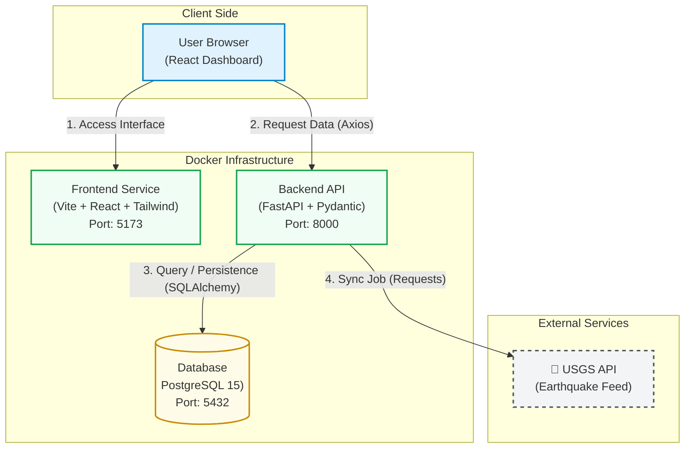
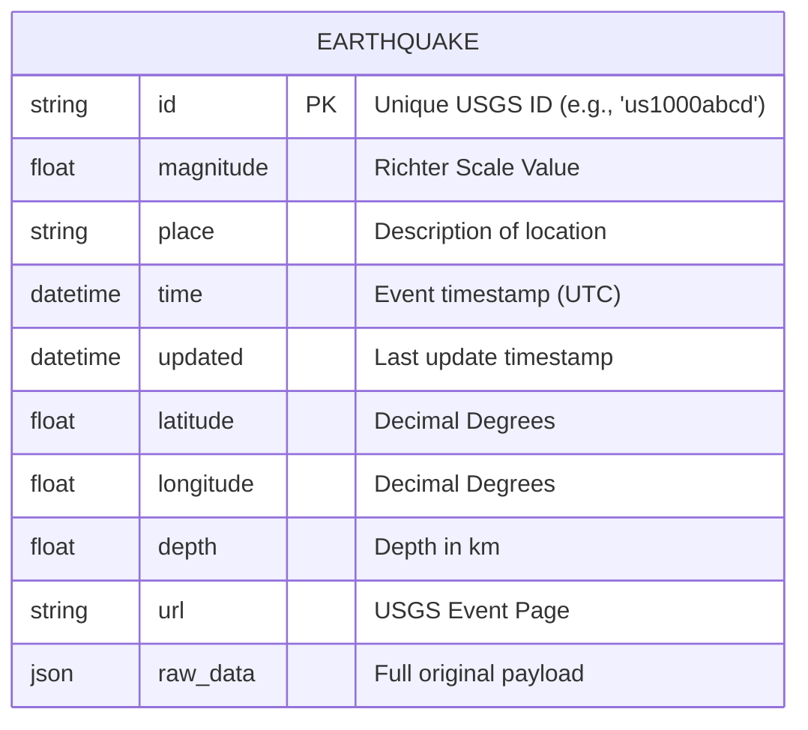
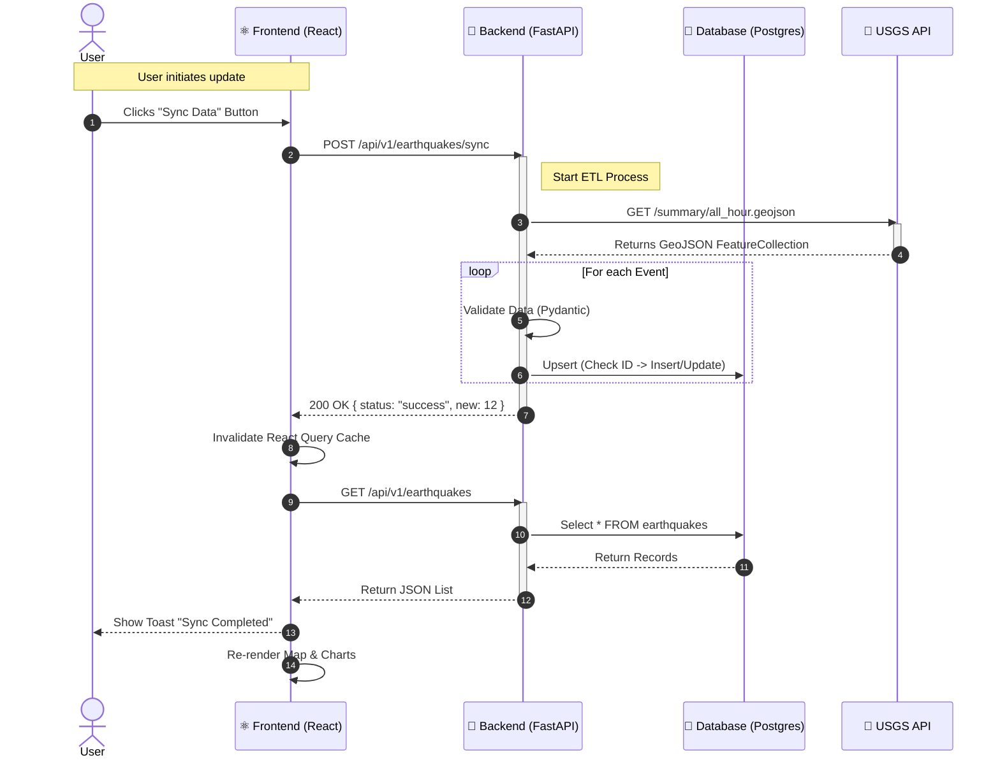
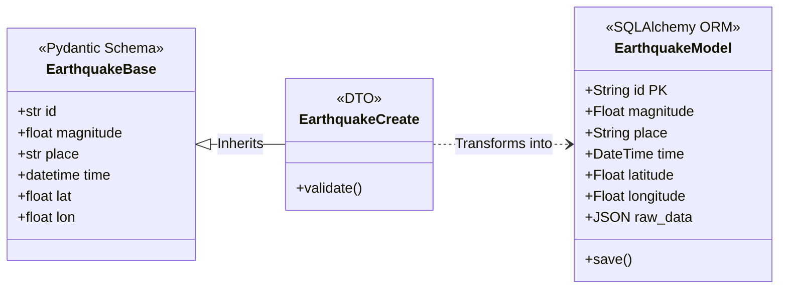

# Global Seismic Monitor (GSM)

> A production-ready Full-Stack seismic monitoring platform, integrating USGS real-time data with interactive geospatial visualization.


## System Architecture

The project utilizes a containerized microservices architecture orchestrated via Docker Compose. The data flow follows an external API ingestion pattern (USGS) with local persistence to ensure high-performance visualization.



## Database Schema (ERD)


## Synchronization Flow (Sequence)



## Technical Design (Backend Classes)



## Key Features

### Data Ingestion (Backend)
- Automated ETL: Dedicated Python service to fetch, clean, and normalize seismic data from USGS.

- Strict Validation: powered by Pydantic v2 to ensure geospatial data integrity.

- RESTful API: Endpoints automatically documented via Swagger UI.

### Visualization (Frontend)
- Geospatial Map: High-performance rendering with Leaflet and Dark Mode tiles.

- Analytical Dashboard: Time-series trends and magnitude distribution charts via Recharts.

- Reactive UX: Instant visual feedback (Toasts with Sonner) and client-side filtering.

- Design System: Modern UI built with Tailwind CSS v3.

## Tech Stack

Layer,Technology,Details
Infrastructure,Docker,"Docker Compose, Multi-stage builds"
Backend,Python 3.11,"FastAPI, SQLAlchemy, Alembic (Structure)"
Frontend,React 18,"Vite, TypeScript, React Query (TanStack)"
Database,PostgreSQL,Relational Geospatial Persistence


## Quick Start Guide

Prerequisites: Docker and Git only.

1.

```bash
git clone https://github.com/pablomigueldias/seismic-monitor
cd seismic-monitor
```
2.

```bash
docker compose up --build
```
3.

Access the Application:

- Main Dashboard: http://localhost:5173

- API Documentation: http://localhost:8000/docs


## Developed by Pablo Ortiz • 2026
